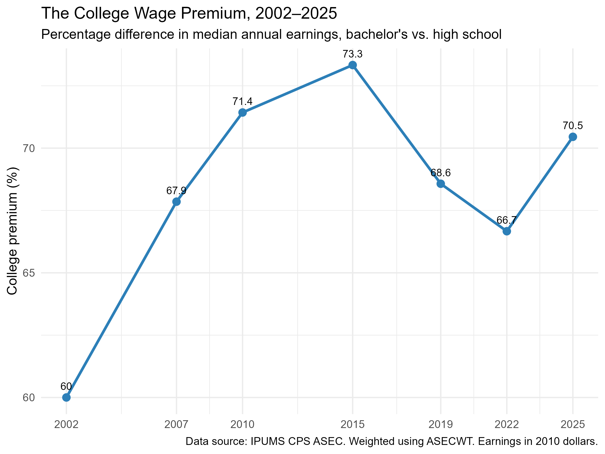
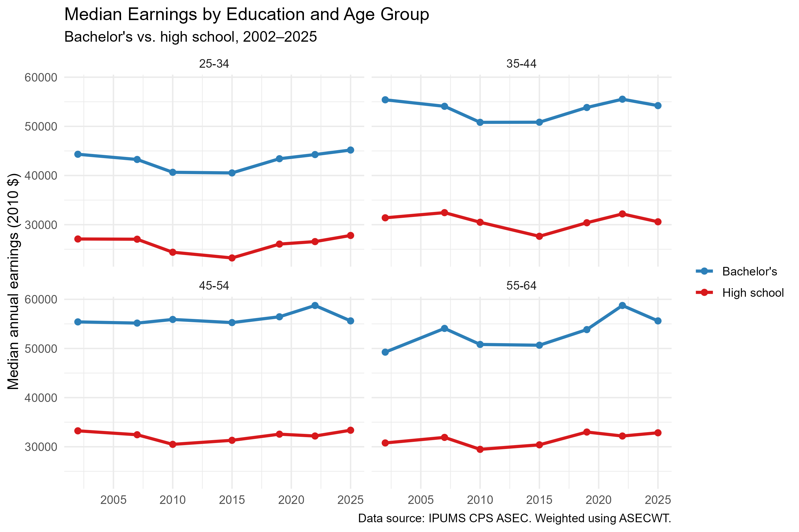
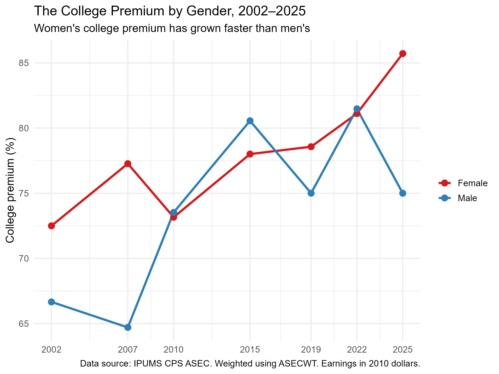

## Introduction

Is a college degree still worth it? It is a debated
questions especially facing the varying market conditions and rapidly evolving industries. 

This analysis uses microeconomic data from the **IPUMS Current Population
Survey (CPS)** to measure the college wage premium — the
percentage difference in median annual earnings between
bachelor's degree holders and high school graduates — from
2002 to 2025.

The headline result: **the premium is large (around 70%) and
stable**, but it is experienced very differently by different
groups. Young workers face more volatility. Women now enjoy
a larger and faster-growing premium than men. Understanding
these differences matters for anyone making decisions about
education, careers, or policy.

## How I Measured It

I used the Annual Social and Economic Supplement (ASEC) of the
CPS, which contains detailed annual income data for a
representative sample of the U.S. population.

To make the analysis representative, I used the **ASECWT
sampling weight** provided by IPUMS. 

I restricted the sample to:
- Adults aged 25–64 (prime working age)
- Workers with positive earnings and hours worked
- High school graduates (`EDUC = 73`) and bachelor's degree
  holders (`EDUC = 111`)

All earnings are adjusted to **2010 dollars** using the CPI-U,
so comparisons across years are not distorted by inflation.

The college premium is defined as:

```
Premium = (Median earnings of bachelor's graduates
         / Median earnings of high school graduates) - 1
```
This research use **median** rather than mean earnings due to the strong right-skewed characteristic of earnings. A small number of
very high earners pull the mean far above the typical worker.
The median is less affected by those
extreme values, so it better represents what a typical
high school or college graduate earns.

## Finding 1: The Premium is in V-shaped trend

{width=90%}

The college premium rose from **60% in 2002** to **73% in 2015**,
then fell to **66.7% in 2022**. After 2022, it rebounded to **70.5% in 2025**. 

One possible reason for the increasing trend before 2015 is that the premium is being drivenby the **shocks to the labor market** — particularly
shocks that hit workers without a degree. 

When low-wage jobs disappear during a recession, high school
graduates' median earnings fall, and the *ratio* that defines
the premium mechanically rises. When those jobs recover, the
premium falls back.

While the decreasing trend happened in the COVID period is another case. During the pandemic, high-paying white-collar positions are also facing the impact of layoffs and remote work. The relative demand for university graduates might weaken around 2022.

## Finding 2: The Volatility comes from high school graduates


{width=90%}


To understand where the V-shape comes from, I split the sample
into four age groups and plotted median earnings separately for
bachelor's and high school graduates.

The result is revealing. **Bachelor's degree holders across all four age groups have remarkably stable earnings.** The blue lines in each graph move by less than 10% over 23 years, even during the financial crisis and the pandemic.

The high school lines (red) are a different story. Their earnings
are more volatile, and the volatility is largest for older
workers:

- **55–64 group**: high school earnings fell from about $31,000
  in 2002 to a low of about $29,000 around 2010, then recovered
  to roughly $33,000 by 2020, before falling back to $32,500
  by 2025.
- **45–54 group**: similar pattern, with a decline around 2010
  and another dip after 2020.
- **25–34 and 35–44 groups**: more stable, with only modest
  year-to-year movement.

The college premium is a **ratio**: bachelor's earnings divided
by high school earnings. If bachelor's earnings are stable and
high school earnings fluctuate, then **the most of the movement in
the premium comes from the denominator**.

In this case, the premium in figure 1 did not rise because college became more valuable. It rose because **high school graduates' earnings were
unusually low** that period.

## Finding 3: A Persistent and Growing Gender Gap in Returns

{width=90%}

The final dimension I examined is gender, and here the pattern
is the most striking of all.

**Women's college premium has been higher than men's for almost the entire period, and the gap has widened over time.** What should be noticed is that a higher premium does not mean that the absolute wage of women with degrees is more than that of men with degrees. It simply means the gap between
degree holders and non-degree holders is larger for women.

In 2002, the premium was 72.5% for women and 66.7% for men — a
6-point difference. By 2025, the gap had grown to more than
10 points: **85.7% for women, 75.0% for men**.

The paths are also different:

- **Women's premium** rose steadily from 72.5% in 2002 to 85.7%
  in 2025 — the most consistent upward trend in the entire
  analysis.
- **Men's premium** was far more volatile. It started at 66.7%,
  briefly fell to 64.8% in 2007, then surged to 80.5% by 2015 —
  briefly overtaking women — before falling back to 75% by 2025.

The pattern is consistent with two well-documented trends in
the U.S. labor market:

1. **Women have been outpacing men in educational attainment**
   for decades. As more women earn college degrees, the
   composition of the female college workforce changes, which
   affects measured earnings.

2. **Male high school graduates have seen their earnings decline**, 
   particularly in manufacturing and other
   traditionally male-dominated industries. Female high school
   graduates' earnings have been more stable (though also low,
   around $24,000 for most of the period).

Together, these trends mean that **the college premium has
become a larger advantage for women than for men** — not
necessarily because women's college earnings are increasing, but
because men's alternatives have gotten worse. This partly reflects the declining fortunes of male workers without a degree.


## Conclusion

The college wage premium remains one of the most important
features of the U.S. labor market. This analysis shows it is
large (around 70%) and experienced very differently across
groups:

1. **The premium is not growing steadily** since 2015 — it fell through 2022 and partially recovered by 2025. 
2. **Old workers (55-64) face more volatility** than younger
   generation among workers without a degree.
3. **The gender gap in the college premium has widened.** women's premium rose steadily to 85.7% by 2025, while
men's was more volatile and reached 75.0%. 


## Limitations

This analysis has several limitations:

- **Descriptive, not causal.** The premium measures the
  correlation between education and earnings. It does not
  prove that college *causes* higher earnings, since college
  graduates differ from non-graduates in many ways.
- **Median-based.** The premium measures the middle of the
  distribution, not the full range.
- **Binary comparison.** Only high school and bachelor's
  degree holders are compared. Associate's and graduate
  degrees are excluded.
- **Selected years.** The analysis uses 7 ASEC years, not
  every year from 2002–2025.


---

*Data source: [IPUMS CPS](https://cps.ipums.org/), Annual
Social and Economic Supplement, 2002–2025. All statistics are
weighted using `ASECWT`. Earnings are adjusted to 2010 dollars
using CPI-U. Full code and data are available in the
[project repository](https://github.com/chelseacui0219-hue/blog3).*